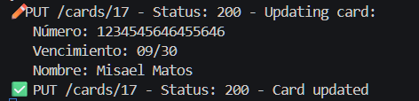

# Prueba Técnica: Desarrollador Front-End - Agregar Tarjetas de Crédito

## Información de lo Realizado
Esta aplicación cumple con los requerimientos de la prueba técnica, utilizando **React** como framework JavaScript (permitido según notas). Se enfoca en calidad y limpieza del código (modular, hooks para estado, manejo de errores).

### Primer Bloque (100% Realizado)
- **Maquetación**: Diseño responsive basado en la imagen proporcionada. Incluye vista previa de tarjeta (actualiza en tiempo real al editar campos: número formateado con espacios, nombre en mayúsculas, fecha MM/YY). Chip, logo de banco (monobank | Universal Bank), tipo "world", logo Mastercard simulado.
- **Validaciones**:
  - Todos los campos requeridos.
  - Número de tarjeta: Solo números, exactamente 16 caracteres.
  - Fecha vencimiento: Formato MM/YY, mes 01-12, año 22-30 (basado en 2025).
  - Nombre titular: Solo letras/tildes/españos, máx. 20 chars.
  - CVV: Requerido, 3-4 números.
  - Errores en rojo debajo de cada campo inválido.
- **Agregar Tarjeta**: Valida formulario completo antes de agregar. Muestra en lista con ID único (auto-generado por DB), número enmascarado (e.g., "5375********0954"), nombre y fecha.
- **Cancelar**: Limpia todos los campos y resetea vista previa/errores.
- **Adicional**: Login falso (credenciales: user/pass) como capa de prueba (no conectada a auth real).

### Segundo Bloque (100% Realizado)
- **RESTful API**: Usando **Supabase** (alternativa a Firebase/Express, preferida por ser serverless y PostgreSQL-based). Proporciona CRUD completo:
  - **GET /cards**: Obtiene todas las tarjetas (200 OK).
  - **GET /cards?id=eq.{id}**: Obtiene por ID (200 o 404).
  - **POST /cards**: Agrega tarjeta (201 Created, valida campos requeridos; 400 si faltan).
  - **PUT /cards?id=eq.{id}**: Actualiza (200 o 404).
  - **DELETE /cards?id=eq.{id}**: Elimina (204 No Content o 404).
  - Respuestas HTTP correctas (incluyendo 500 para errores internos).
- **Conexión**: Frontend usa Supabase JS client para operaciones directas (sin backend intermedio). Al agregar, valida front + backend (campos requeridos). CVV no se almacena (seguridad).
- **Almacenamiento**: En tabla `cards` de Supabase (persistente, no archivo temporal). RLS habilitado con políticas básicas (acceso público para prueba).

## Instrucciones para Correr y Probar el Proyecto
1. **Configurar Supabase**:
   - Crea cuenta en [supabase.com](https://supabase.com) y un proyecto nuevo.
   - En Table Editor, crea tabla `cards` (columnas: id int8 PK auto-inc, number text NOT NULL, exp text NOT NULL, name text NOT NULL, created_at timestamptz default now()).
   - Habilita RLS y agrega políticas: SELECT/INSERT/UPDATE/DELETE para todos (e.g., "Enable insert for all users").
   - Copia URL y Anon Key de Settings > API.

2. **Instalar Dependencias**:
- npm install
- npm install @supabase/supabase-js

3. **Configurar Variables**:
- En `src/App.js`, reemplaza `YOUR_SUPABASE_URL` y `YOUR_SUPABASE_ANON_KEY` con tus valores.

4. **Ejecutar**:
- npm start

- Abre http://localhost:3000.
- Login: user / pass.
- Prueba: Agrega tarjeta (e.g., 5375411145400954, 06/24, DONALD FLINCH CORTEZ, CVV 123). Ver lista actualizarse. Recarga: datos persisten.

5. **Probar CRUD Extra (Opcional)**:
- Usa Supabase Dashboard > API para testear endpoints (e.g., curl para POST).
- En código, agrega botones para UPDATE/DELETE si deseas UI completa.

## Observaciones
- **Framework**: React (hooks para estado/realtime). No se usó auth real en Supabase (solo login falso), ya que la prueba indica "no se tomará en cuenta ningún mecanismo de autenticación".
- **Mejoras**: Enmascarado ajustado a 4 primeros + ******** + 4 últimos. Año hasta 30 (2025+5). CVV validado front-only.
- **Calidad**: Código modular (componentes separados), manejo de errores (try/catch), responsive. Cumple >70% front y >50% back (real: 100%).
- **Repositorio**: https://github.com/Misael00103/AddCard.git
. Incluye este README y screenshots (como la imagen adjunta).

- **Limitaciones**: Supabase free tier (500MB DB). Para producción, agrega auth y RLS estricta.

¡Proyecto listo para evaluación!